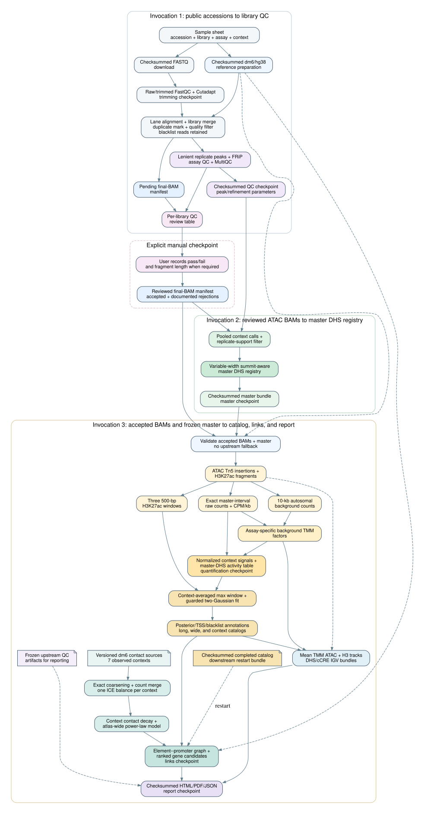

# Drosophila cCREs

Reproducible ATAC-seq and ChIP-seq processing from public accessions to a
summit-aware master DHS registry, a context-resolved regulatory-element
catalog, and context-specific element--promoter candidate links. Catalog
contexts come from the canonical input table; the contact-source mapping is a
versioned dm6 atlas resource.

The production path has three phases separated by an explicit manual QC gate:

1. process reads through library QC and export `pending_review` BAM manifests;
2. review every library, then construct the master DHS set from accepted ATAC
   libraries only;
3. quantify accepted ATAC/H3K27ac BAMs, normalize with background TMM, fit the
   guarded H3K27ac mixtures, write posterior- and blacklist-annotated catalogs,
   then normalize the available contact maps and build candidate-gene links.

There is no external regulatory-element reference or quantile-normalization
branch. Strict reuse of a checksummed master-DHS bundle is supported.

## Quick start

### Install the environment

Prerequisites are a POSIX shell, Git, and a working `mamba` installation. From
the repository root, create the orchestration environment inside the project:

```bash
export MAMBA_ROOT_PREFIX="$PWD/.micromamba"
export CONDA_PKGS_DIRS="$PWD/.micromamba/pkgs"
export CONDA_ENVS_PATH="$PWD/.micromamba/envs"
export CONDARC="$PWD/.condarc"
export XDG_CACHE_HOME="$PWD/.cache"
mamba env create --prefix "$PWD/.venv" --file environment.yml
```

Confirm that the launcher is available:

```bash
mamba run --prefix "$PWD/.venv" python src/run_pipeline.py --help
```

For the commands below, either activate the environment once:

```bash
mamba activate "$PWD/.venv"
```

or keep using `mamba run --prefix "$PWD/.venv"` for each Python command.

The local Snakemake profile creates the pinned rule environments below
`.snakemake/conda` on first use. That first run therefore needs network access
and takes longer than a restart. Keep `.venv`, `.micromamba`, `.cache`, and the
rule environments inside the repository; do not create project environments
under a shared home-directory prefix.

### Prepare and validate the input table

Create a CSV or TSV with `accession`, `library_id`, `assay`, and `context`
columns. Then validate it before downloading data:

```bash
mamba run --prefix "$PWD/.venv" \
  python src/validate_sample_sheet.py path/to/samples.tsv
```

The tracked atlas tables under `resources/` are runnable examples. Optional
control, peak-caller, and processing columns are defined in
`schemas/sample-sheet.schema.yaml`.

### Run the pipeline

The production path uses three workflow invocations separated by a manual
review checkpoint. Commands in the remainder of this README assume the
environment is active.

1. Start from accessions and stop at `qc`. This downloads reads, prepares the
   reference, processes every library, and writes the QC review table and a
   `pending_review` final-BAM manifest.
2. Record pass/fail decisions in a copy of the review table and create a
   reviewed manifest with `src/review_final_bam_manifest.py`.
3. Start from the completed `qc` checkpoint plus the reviewed ATAC manifest
   and stop at `master`. The lenient replicate peak evidence is reused; only
   context pooling, support filtering, and master construction run downstream.
4. Start from `master` with the accepted ATAC/H3K27ac manifests. Stop at
   `quantification`, `catalog`, `links`, or `report`. For the complete
   nine-context dm6 atlas, the links stage downloads and normalizes the
   versioned contact sources automatically.

Use the same `project` and `run_id` to resume an invocation. Use a new `run_id`
when scientific parameters or selected libraries change. Before a large run,
add `--snakemake-dry-run` to inspect the planned jobs. `--cores` limits total
local/cluster cores; `--jobs` limits concurrent cluster jobs. Complete commands
for each invocation appear in [Phase 1](#phase-1-master-dhs-construction) and
[Phase 2](#phase-2-quantification-catalog-and-links).

## Pipeline DAG

The workflow is shown top-to-bottom, with the manual review and immutable
manifest boundaries separating the three invocations:



The editable graph source is [`docs/workflow-dag.dot`](docs/workflow-dag.dot).
For the detailed scientific reasoning and equations, see
[`docs/pipeline-description.pdf`](docs/pipeline-description.pdf).

## Input table

The public input is a CSV or TSV conforming to
`schemas/sample-sheet.schema.yaml`. Its canonical columns are:

| Column | Meaning |
|---|---|
| `accession` | Public run or experiment accession |
| `library_id` | Biological library; technical runs share an ID |
| `assay` | `atac`, `h3k27ac`, or another supported ChIP assay |
| `context` | Tissue, stage, or cell type |

Optional control and MACS3 parameter columns are documented in the schema.
ATAC peak calling is fixed to the two-ended Tn5/MACS3-qpois method;
`peak_caller`, when supplied, must be `callpeak`. The two reviewed dm6 atlas
inputs are `resources/atlas_samples_ip_only.tsv` and
`resources/atlas_samples_with_inputs.tsv`.

Each distinct ATAC `context` becomes a replicate-pooling group. Consequently,
the same code can build a master from the nine atlas contexts or any other set
of contexts present in an input table. The default consensus requires at least
two biological ATAC libraries per context.

## Logical stages and restart behavior

`--until-stage` selects a reproducible stopping boundary:

| Stage | Completed result |
|---|---|
| `trimming` | raw/trimmed FastQC, Cutadapt metrics, trimmed FASTQs |
| `alignment` | quality-filtered, blacklist-retaining final BAM/BAI, alignment QC, final-BAM manifest |
| `qc` | peaks, FRiP and assay QC, MultiQC |
| `master` | replicate-supported context peaks and master DHS bundle/manifest |
| `quantification` | raw, CPM/kb, background-TMM factors and normalized master-element signals |
| `catalog` | max-window H3K27ac mixtures, annotated long/wide/context tables, BED/BigWig tracks, and IGV sessions |
| `links` | normalized contact matrices, the atlas contact-decay model, promoter nodes, context element--promoter edges, and ranked element--gene candidates |
| `report` | integrated, checksummed HTML/PDF QC report spanning inputs through the links |

Snakemake owns completeness. Re-running the same `project`/`run_id` resumes
from existing valid outputs and never realigns merely because a later stage is
requested. Advancing `--until-stage` does not change the scientific semantic
digest. Incomplete outputs are rebuilt because the profiles retain
`rerun-incomplete: true`.

`work/<project>/<run_id>/` contains reproducible intermediates rather than
archive outputs. Large intermediates (trimmed FASTQs after alignment, lane and
marked BAMs, shifted/short-fragment BAMs, peak-calling insertion BEDs, and
background-count tables) are declared temporary and Snakemake removes them
after their last consumer. Quantification assay-unit BEDs are retained below
`activity/quantification/units/` because catalog restart and mean-track
construction require exactly those units.
Keep `work/` while a run is active; after successful completion it may be
removed to clear any small files or debris left by an interrupted older run.
Per-library ChIP CPM BigWigs are not generated because no downstream result
uses them; pooled ATAC pileup/qpois and context-mean catalog BigWigs remain
distinct, retained final products. Final replicate-level ATAC peak evidence is
stored below `results/<project>/<run_id>/atac/replicates/`, not under `work/`.

Every endpoint exports
`provenance/manifests/<stage>.checkpoint.json`. Checkpoint files record the
scientific semantic digest, stage parameters, paths, and SHA-256 hashes. Each
one also points to an immutable
`provenance/configs/<stage>.resolved_config.json` snapshot, so completing a
later stage does not invalidate an earlier restart boundary.
Starting at a completed boundary is strict: missing or changed checkpoint
artifacts cause an error rather than upstream recomputation.

| `--from-stage` | Required artifact | Allowed stopping points |
|---|---|---|
| `accessions` | accession table/download manifest | trimming through QC |
| `trimming` | trimming `--checkpoint-manifest` | trimming, alignment, or QC in the same run namespace |
| `alignment` | alignment checkpoint or `--final-bam-manifest` | alignment or QC |
| `qc` | QC checkpoint; reviewed ATAC `--final-bam-manifest` for master | QC or master |
| `master` | `--master-manifest`; accepted BAM manifests when continuing | master, quantification, catalog, links, or report |
| `quantification` | quantification checkpoint | quantification, catalog, links, or report |
| `catalog` | catalog checkpoint, or `--catalog-manifest` for an immutable external catalog | catalog, links, or report from a checkpoint; links only from a catalog manifest |
| `links` | links checkpoint | links or report |
| `report` | report checkpoint | report validation |

`final-bam` remains a compatibility alias for older commands. New commands
should use `alignment` for BAM-to-QC and `qc` for reviewed QC-to-master reuse.

The workflow automatically exports:

```text
results/<project>/<run_id>/provenance/manifests/final-bams.tsv
results/<project>/<run_id>/qc/library-review.tsv
results/<project>/<run_id>/provenance/manifests/master-dhs.tsv
results/<project>/<run_id>/provenance/manifests/<stage>.checkpoint.json
```

Automatically exported new BAMs have `qc_status=pending_review`. The QC endpoint
also writes a single human-readable row per library to `qc/library-review.tsv`.
Apply explicit pass/fail decisions with `src/review_final_bam_manifest.py`.
Master DHS
construction refuses any `pending_review` ATAC row, excludes documented
rejections, and records those exclusions in the resolved configuration. Each
remaining ATAC context must still satisfy `--atac-minimum-replicates`.
Quantification likewise requires reviewed ATAC and H3K27ac manifests. Rejected
libraries require a reason. Single-end H3K27ac libraries also require a
reviewed `estimated_fragment_length_bp`.

## Phase 1: master DHS construction

First process accessions through QC. Omitting `--until-stage` has the same QC
endpoint in accession mode:

```bash
python src/run_pipeline.py resources/atlas_samples_ip_only.tsv \
  --project drosophila-atlas --run-id qc-v1 --genome dm6 \
  --until-stage qc --cores 16
```

This first run:

1. downloads immutable FASTQs with checksums and resume state;
2. runs lane-level QC/trimming/alignment;
3. merges technical runs by `library_id`, marks duplicates, and applies MAPQ,
   alignment-flag, duplicate, and mitochondrial filters while retaining reads
   that overlap the reference blacklist;
4. calls replicate peaks and produces FRiP, ATAC TSS/fragment, H3K27ac
   cross-correlation, and MultiQC outputs;
5. exports a final-BAM manifest whose new libraries are `pending_review` and a
   populated `qc/library-review.tsv` for manual review.

The review table contains context and layout, final-BAM depth, proper-pair
fraction, FRiP, peak count, assay-specific metrics, and paths to MultiQC and
the per-library plots. ATAC rows include TSS enrichment, fragment-length
median, and fractions below 150 bp and from 180--250 bp. TSS enrichment is the
maximum aggregate signal in the central +/-50 bp divided by the mean signal in
the two terminal 100-bp flanks of the +/-2-kb profile. Histone/ChIP rows include
phantompeakqualtools fragment-shift estimates, NSC, RSC, and quality tag.
For paired-end data, FRiP counts one valid same-chromosome fragment per read
pair in the denominator and one fragment overlapping any called peak in the
numerator. For single-end data, the corresponding unit is one filtered read.

Newly generated manifests use the `short-read-processing-final-v2` contract.
Unlike v1, v2 does not remove blacklist-overlapping alignments. The catalog
instead annotates each master DHS with `blacklist_overlap`,
`blacklist_overlap_bp`, and `blacklist_overlap_fraction`. A v1 BAM cannot be
converted into a true v2 BAM because the removed reads cannot be recovered;
rebuild from the accession/FASTQ phase when adopting this policy.
Master-bundle manifests also record their input filtering contract, preventing
an older blacklist-filtered master from being silently combined with v2 BAMs.

Copy the generated table outside the Snakemake result namespace, then edit only
the final three review columns. Set `qc_decision` to `pass` or `fail`; a failed
row requires a reason in `notes`. The suggested phantompeakqualtools shift is
pre-populated as `estimated_fragment_length_bp` for single-end H3K27ac and
should be reviewed rather than accepted blindly.

```bash
mkdir -p data/reviewed
cp results/<qc-project>/qc-v1/qc/library-review.tsv \
  data/reviewed/atlas-atac.library-review.tsv
```

Apply the decisions without editing the generated manifest in place:

```bash
python src/review_final_bam_manifest.py \
  results/<qc-project>/qc-v1/provenance/manifests/final-bams.tsv \
  --review-table data/reviewed/atlas-atac.library-review.tsv \
  --output data/reviewed/atlas-atac.reviewed.tsv
```

The command maps `pass` to final-manifest `qc_status=accepted` and `fail` to
`qc_status=rejected`, verifies that every library has exactly one decision, and
does not alter the original manifest. The older `--decisions` option and
`accepted`/`rejected` values remain supported for compatibility.

Then construct the master from the reviewed ATAC manifest. This strict reuse
mode cannot download FASTQs, trim reads, or align again:

```bash
python src/run_pipeline.py resources/atlas_samples_ip_only.tsv \
  --from-stage qc \
  --checkpoint-manifest \
    results/<qc-project>/qc-v1/provenance/manifests/qc.checkpoint.json \
  --final-bam-manifest data/reviewed/atlas-atac.reviewed.tsv \
  --project drosophila-atlas --run-id master-v1 --genome dm6 \
  --until-stage master --cores 16
```

QC calls the lenient ATAC replicate candidates once with `-q 0.10`, unscaled
two-ended Tn5 pileup/local lambda, and qpois refinement over exponents 2--325
with retained components of 50--400 bp. The checkpoint binds those complete
parameters and checksums the refined replicate BEDs. This second run validates
and reuses that evidence; it pools accepted libraries within each context,
calls/refines the pooled context signal, applies replicate support, and builds
the summit-aware variable-width master registry. A changed peak or refinement
parameter is rejected rather than silently recomputed under the checkpoint.
Rejected rows remain in the reviewed manifest and are recorded in
`provenance.excluded_master_libraries`.

The master is not a simple interval union or fixed-width resize. It preserves
representative summits, reciprocal-summit clustering, the configured maximum
summit span, and context membership.

To regenerate QC directly from already filtered BAMs, start at the completed
alignment boundary. No FASTQ or alignment fallback is available:

```bash
python src/run_pipeline.py resources/atlas_samples_ip_only.tsv \
  --from-stage alignment \
  --final-bam-manifest data/reviewed/atlas.pending-review.tsv \
  --project drosophila-atlas --run-id qc-v1 --genome dm6 \
  --until-stage qc --cores 16
```

There is no interactive pause inside Snakemake. The completed QC job and the
review command form the explicit checkpoint; a separate master invocation is
required. A master invocation with any pending ATAC decision fails before
Snakemake starts.

## Phase 2: quantification, catalog, and links

Use the same accession table as metadata, the exported master manifest, and
one or more reviewed final-BAM manifests:

```bash
python src/run_pipeline.py resources/atlas_samples_ip_only.tsv \
  --from-stage master \
  --master-manifest \
    results/drosophila-atlas/master-v1/provenance/manifests/master-dhs.tsv \
  --activity-bam-manifest data/reviewed/atlas-atac.accepted.tsv \
  --activity-bam-manifest data/reviewed/atlas-h3k27ac.accepted.tsv \
  --report-source-root results/drosophila-atlas/master-v1 \
  --report-source-root results/drosophila-atlas-h3k27ac/qc-v1 \
  --project drosophila-atlas --run-id catalog-v1 --genome dm6 \
  --until-stage report --cores 16
```

This mode validates hashes and BAM/reference compatibility before computation.
It cannot download FASTQs or invoke alignment.

Use `--until-stage quantification` to stop after counting and normalization.
Continue strictly from its exported checkpoint, using the same sample sheet
and original result namespace:

```bash
python src/run_pipeline.py resources/atlas_samples_ip_only.tsv \
  --from-stage quantification \
  --checkpoint-manifest \
    results/drosophila-atlas/catalog-v1/provenance/manifests/quantification.checkpoint.json \
  --until-stage report --cores 16
```

Repeated `--report-source-root` values on the master-boundary command freeze the
upstream manifests, JSON metrics, TSS profiles, fragment histograms,
cross-correlation results, and MultiQC locations into the report configuration.
The master-manifest result root is discovered automatically when possible.
Report inputs affect only reporting and are excluded from the scientific
semantic digest.

## Contact normalization and candidate-gene links

The canonical nine-context dm6 configuration automatically reads
`resources/atlas_contact_sources.tsv`. Seven contexts have observed contact
evidence: `ab`, `e5`, `e11`, `ead`, `lb`, `o`, and `wid`. The `o` evidence is
Hi-C at 4 kb; the other observed contexts use Micro-C at 5 kb. No defensible
context-matched map is assigned to `e13` or `hid`, so those two contexts are
explicitly labeled `powerlaw` and use an atlas-wide distance model fitted from
the seven observed maps. A partial or non-dm6 catalog does not silently inherit
this atlas mapping and cannot select the `links` endpoint without an explicit,
valid contact configuration.

A completed catalog can enter the link stage without revalidating or relabeling
its historical BAMs. First export a one-row bundle manifest, then start a new
result namespace from that catalog:

```bash
python src/create_catalog_manifest.py \
  results/drosophila-atlas/catalog-from-reviewed-v1 \
  --output data/reviewed/atlas-catalog.reviewed.tsv

python src/run_pipeline.py resources/atlas_samples_ip_only.tsv \
  --from-stage catalog --until-stage links \
  --catalog-manifest data/reviewed/atlas-catalog.reviewed.tsv \
  --project drosophila-atlas --run-id contact-links-from-catalog-v1 \
  --genome dm6 --cores 8 \
  --snakemake-arg=--resources \
  --snakemake-arg=mem_mb=16000 \
  --snakemake-arg=contact_download_slots=2
```

The manifest binds the long catalog, catalog metrics, catalog provenance, and
the source resolved configuration by SHA-256. It also records the exact context
order and source semantic digest. The supplied accession table must hash to the
same table recorded by the source catalog. This path consumes the existing
context rows directly, writes only contact/link products in the new run, and
does not schedule quantification, catalog reconstruction, BigWigs, or IGV
sessions. A catalog checkpoint remains the appropriate input when continuing
inside the original run namespace.

Contact files download to `data/raw/contacts/`. For each observed context, the
workflow selects a stored resolution that exactly divides the target
resolution, coarsens by summing raw counts when needed, sums replicate count
matrices, and performs one ICE balancing pass on the merged matrix. It never
averages pre-balanced replicates or approximately rebins incompatible
resolutions. GEO contact downloads use one resumable connection because its
supplementary-file server rejects parallel range requests. When an upstream
checksum is published it is checked during the
resumable download; every downloaded source and normalized matrix receives a
recorded SHA-256 in the result provenance. Converted and coarsened copies under
`work/` are removed after the balanced context matrix is written successfully.
Each GEO file uses one HTTP connection; the optional
`contact_download_slots` aggregate resource controls how many independent files
Snakemake downloads concurrently.

The current dm6 GTF supplies one promoter node per distinct gene/TSS, using a
fixed 500-bp promoter window. In each context, promoter activity is summarized
from overlapping context-member master DHSs. A promoter is marked active when
it is ATAC-accessible and its maximum H3K27ac high-component posterior is at
least 0.5. Every context-member element is linked to promoters on the same
chromosome within 1 Mb. Observed contexts report the ICE-balanced matrix pixel,
the fitted distance expectation, and observed/expected enrichment. Same-bin
pairs use the maximum adjacent-bin contact and are labeled
`adjacent_bin_proxy`, because a matrix diagonal cannot resolve an internal
element--promoter contact. The two missing contexts report distance-model
weights only.

The decay fit uses the mean of finite balanced diagonal pixels at each sampled
distance, including valid zero pixels and excluding masked bins. This avoids
inflating the model by conditioning only on nonzero contacts.

The promoter activity score is the maximum of
`combined_activity × H3K27ac_posterior` over individual overlapping DHSs; the
two maxima are not taken from different DHSs and multiplied. The edge score is
`contact_weight × promoter_activity_score`.
It is a prioritization score, not a calibrated probability or causal claim.
The element--gene table collapses alternative promoters per gene and reports
candidate, active-candidate, contact-only, and nearest-gene ranks so users can
compare the sources of evidence rather than accepting one fixed target call.
The edge table is intentionally normalized: coordinates, transcript IDs, and
element annotations live in the node table rather than being repeated on every
edge. `source_node_id` and `target_node_id` join the two files.

## Quantification method

Assay units are prepared independently:

- paired-end ATAC retains proper pairs with `0 < abs(TLEN) < 150`, applies the
  Tn5 shift, and counts one-base insertions over each exact variable-width
  master DHS;
- paired-end H3K27ac counts one fragment per proper pair;
- single-end H3K27ac extends reads using the reviewed fragment length.

The pipeline saves per-library raw counts and CPM/kb. It estimates TMM factors
separately for ATAC and H3K27ac from raw counts in fixed 10-kb autosomal
background bins. Context values are equal-weight means of normalized biological
libraries. The quantification table retains raw, CPM/kb, normalized CPM/kb,
replicate SD, and `sqrt(ATAC × H3K27ac)` values.

## H3K27ac signal and guarded mixtures

For every master summit, H3K27ac is counted in three clipped, non-overlapping
500-bp windows:

```text
left:   [summit-750, summit-250)
center: [summit-250, summit+250)
right:  [summit+250, summit+750)
```

Replicates are averaged within context before selecting the maximum normalized
window. The two-Gaussian model is fitted to positive `log10(max-window
H3K27ac)` values among DHSs open in that context.

A fit is marked supported only if all guards pass:

- at least 200 positive member DHSs;
- `BIC(one Gaussian) - BIC(two Gaussians) >= 10`;
- Ashman's D is at least 2;
- both component weights are at least 0.10;
- exactly one posterior-0.5 crossing lies between the component means;
- the fitted population has nonzero variance.

Whenever a two-component fit exists, every positive member DHS is assigned to
`low` or `high` using posterior probability 0.5, even if a guard fails. Such
rows are retained with `mixture_supported=0`,
`mixture_guardrail_warning=1`, and the exact semicolon-separated failures in
`mixture_guardrail_failures`. No unsupported call is silently promoted to a
supported one.

## Regulatory classes

Distance is measured from the master DHS summit to the nearest reference TSS:

| Class | Summit-to-TSS distance |
|---|---:|
| `promoter_associated` | ≤250 bp |
| `proximal_enhancer_like` | 251–1,000 bp |
| `distal_enhancer_like` | >1,000 bp |
| `unclassified_no_tss_on_contig` | no TSS on that contig |

For positive H3K27ac signal at a context-member DHS,
`mixture_high_posterior_probability` is the fitted probability of membership
in the high component. `mixture_component` and `mixture_high_posterior` are
derived at 0.5 for summaries, but they do not filter the catalog or the
per-context element exports. Zero-signal members have a blank posterior and
`activity_state=accessible_no_h3k27ac_signal`.

The long and wide tables also retain the absolute summit-to-nearest-TSS
distance and the blacklist overlap annotations. Users can therefore choose a
posterior threshold, a TSS-distance definition, and a blacklist-overlap policy
for each downstream analysis rather than accepting a fixed enhancer list.

For example, this writes context-member, distal candidates with posterior at
least 0.9 and no blacklist overlap while discovering columns from the header:

```bash
gzip -dc results/<project>/<run_id>/activity/catalog/master_elements_long.tsv.gz |
awk -F '\t' 'BEGIN {OFS=FS}
NR==1 {for (i=1; i<=NF; i++) column[$i]=i; print; next}
$(column["context_membership"]) == 1 &&
$(column["mixture_high_posterior_probability"]) != "" &&
$(column["mixture_high_posterior_probability"]) >= 0.9 &&
$(column["nearest_tss_distance_bp"]) > 1000 &&
$(column["blacklist_overlap"]) == 0' > distal.posterior-0.9.tsv
```

## Browser tracks and IGV sessions

The catalog stage creates a self-contained visualization bundle for every
context. The context DHS BED uses the master-DHS coordinates for rows with
`context_matrix` membership equal to one; it is therefore directly aligned
with the catalog rather than reproducing the wider upstream pooled-peak
boundaries. The context-element BED retains every member. It is BED9: the
thick one-base interval marks the representative summit, the score is the
high-component posterior scaled to 0--1,000 (zero when the posterior is not
applicable), and item RGB distinguishes the TSS-distance classes. Blacklist
overlaps are black. The name records the exact TSS distance, posterior,
mixture component, guardrail status, and blacklist-overlap status.

For each assay and context, every accepted library is first scaled by
`1e6 / effective_library_size` using the same assay-specific background-TMM
factor as the activity table. For browser display, each shifted one-base ATAC
insertion is expanded to a centered, chromosome-clipped 150-bp interval before
coverage is calculated. The context BigWig is the arithmetic mean of those
scaled library pileups. This is denser than displaying isolated cut sites while
preserving the insertion-based library definition and the 150-bp representation
used by MACS3. H3K27ac BigWigs remain mean normalized fragment coverage.
Temporary per-library bedGraphs are removed; only the context BigWig and its
JSON sidecar are retained. The resolved activity configuration records
`atac_browser_extension_bp: 150`, so the representation participates in the
run's semantic digest.

Opening `activity/catalog/igv/<context>.xml` loads five relative, portable
resources: the global master-DHS registry first, followed by the mean ATAC
150-bp pileup, mean H3K27ac, context DHSs, and posterior-scored candidate
elements. With the genome gene track enabled, the master registry is the first
custom track immediately below the gene/GTF annotation. Opening
`activity/catalog/all-contexts.igv.xml` loads the master registry once plus
those four context-specific tracks for every context, so the complete atlas can
be compared in one session. Keep the session XML, `bed/`, and `tracks/`
together under `activity/catalog/` if the catalog is moved.

To combine the pooled ATAC evidence and final regulatory-element annotations in
one compact session, point the standalone builder at the completed master and
catalog runs:

```bash
python src/build_igv_session.py results/<project>/<master-run>/atac \
  --master-bed results/<project>/<master-run>/atac/master/master_dhs.bed \
  --catalog-bed-root results/<project>/<catalog-run>/activity/catalog/bed \
  --output results/<project>/igv/pipeline-results.xml --genome dm6
```

The master registry is the first custom track immediately below IGV's
gene/GTF annotation. It is followed, for each context, by the background-TMM
mean 150-bp ATAC Tn5 pileup, pooled ATAC qpois signal, background-TMM mean
H3K27ac fragment coverage, context DHSs, and posterior-scored candidate cCREs.
The raw pooled MACS3 ATAC pileup is deliberately omitted because it is
unscaled and depth-dependent; it remains an auditable master-calling output.
Replicate H3K27ac signal, H3K27ac peaks, and intermediate ATAC candidates are
also omitted. Both mean tracks are read from the catalog's sibling `tracks/`
directory; use `--catalog-track-root` only when that directory is elsewhere.

## Outputs

Master bundle:

```text
results/<project>/<run_id>/atac/master/master_dhs.bed
results/<project>/<run_id>/atac/master/master_dhs_summits.bed
results/<project>/<run_id>/atac/master/master_dhs_membership.tsv
results/<project>/<run_id>/atac/master/master_dhs_context_matrix.tsv
results/<project>/<run_id>/atac/master/master_dhs.json
```

Quantification:

```text
results/<project>/<run_id>/activity/quantification/units/*.bed.gz
results/<project>/<run_id>/activity/quantification/units/*.count.txt
results/<project>/<run_id>/activity/quantification/libraries/*.signal.tsv.gz
results/<project>/<run_id>/activity/quantification/tmm_input_counts.tsv.gz
results/<project>/<run_id>/activity/quantification/normalization_factors.tsv
results/<project>/<run_id>/activity/quantification/context_signal.tsv.gz
results/<project>/<run_id>/activity/quantification/master_dhs_activity.tsv.gz
results/<project>/<run_id>/activity/quantification/activity_metrics.json
results/<project>/<run_id>/activity/quantification/activity_provenance.json
```

Catalog:

```text
results/<project>/<run_id>/activity/catalog/master_elements_long.tsv.gz
results/<project>/<run_id>/activity/catalog/master_elements_wide.tsv.gz
results/<project>/<run_id>/activity/catalog/elements/<context>.elements.tsv.gz
results/<project>/<run_id>/activity/catalog/mixture_models.tsv
results/<project>/<run_id>/activity/catalog/regulatory_element_summary.tsv
results/<project>/<run_id>/activity/catalog/h3k27ac_mixture_distributions.svg
results/<project>/<run_id>/activity/catalog/regulatory_element_metrics.json
results/<project>/<run_id>/activity/catalog/regulatory_element_provenance.json
results/<project>/<run_id>/activity/catalog/bed/master_dhs.bed
results/<project>/<run_id>/activity/catalog/bed/<context>.dhs.bed
results/<project>/<run_id>/activity/catalog/bed/<context>.elements.bed
results/<project>/<run_id>/activity/catalog/bed/bed_tracks.json
results/<project>/<run_id>/activity/catalog/tracks/<context>.atac.mean.background_tmm.bw
results/<project>/<run_id>/activity/catalog/tracks/<context>.h3k27ac.mean.background_tmm.bw
results/<project>/<run_id>/activity/catalog/tracks/<context>.<assay>.mean.background_tmm.json
results/<project>/<run_id>/activity/catalog/igv/<context>.xml
results/<project>/<run_id>/activity/catalog/all-contexts.igv.xml
```

Contact links:

```text
results/<project>/<run_id>/activity/links/contacts/<context>.balanced.cool
results/<project>/<run_id>/activity/links/contacts/<context>.metrics.json
results/<project>/<run_id>/activity/links/contacts/dm6_powerlaw.json
results/<project>/<run_id>/activity/links/promoters.tsv.gz
results/<project>/<run_id>/activity/links/promoters.metrics.json
results/<project>/<run_id>/activity/links/contexts/<context>.nodes.tsv.gz
results/<project>/<run_id>/activity/links/contexts/<context>.element_promoter_edges.tsv.gz
results/<project>/<run_id>/activity/links/contexts/<context>.element_gene_candidates.tsv.gz
results/<project>/<run_id>/activity/links/contexts/<context>.metrics.json
results/<project>/<run_id>/activity/links/contact_graph_metrics.json
results/<project>/<run_id>/activity/links/contact_graph_provenance.json
```

Integrated report:

```text
results/<project>/<run_id>/activity/report/integrated_qc_report.html
results/<project>/<run_id>/activity/report/integrated_qc_report.pdf
results/<project>/<run_id>/activity/report/integrated_qc_report.json
```

The report includes frozen input and output inventories with checksums, BAM QC
and FRiP statistics, H3K27ac cross-correlation, ATAC TSS plots, master-registry
statistics, TMM factors, high-component TSS classes, mixture fits, exact
guardrail warnings, and contact-link coverage by context. The JSON sidecar
records every report input and output hash.

The long table contains one master-element/context row and reports both mixture
components, continuous posterior, TSS distance, and blacklist overlap. The
wide table contains one row per master element with context-prefixed
membership, signal, mixture, warning, and activity columns plus the shared TSS
and blacklist annotations. Each per-context element file contains every
context member, including low-component and zero-signal rows. The BED and
mean-signal sidecars are also explicit report inputs, so their paths and
checksums appear in the integrated audit trail.

## Verification

```bash
export MAMBA_ROOT_PREFIX="$PWD/.micromamba"
export CONDA_PKGS_DIRS="$PWD/.micromamba/pkgs"
export CONDA_ENVS_PATH="$PWD/.micromamba/envs"
export CONDARC="$PWD/.condarc"
export XDG_CACHE_HOME="$PWD/.cache"

mamba run --prefix "$PWD/.venv" pytest -q
mamba run --prefix "$PWD/.venv" \
  snakemake --snakefile workflow/Snakefile \
  --configfile tests/fixtures/workflow_config.yaml --lint
mamba run --prefix "$PWD/.venv" \
  snakemake --snakefile workflow/Snakefile \
  --configfile tests/fixtures/workflow_config.yaml --cores 8 --dry-run
git diff --check
```
